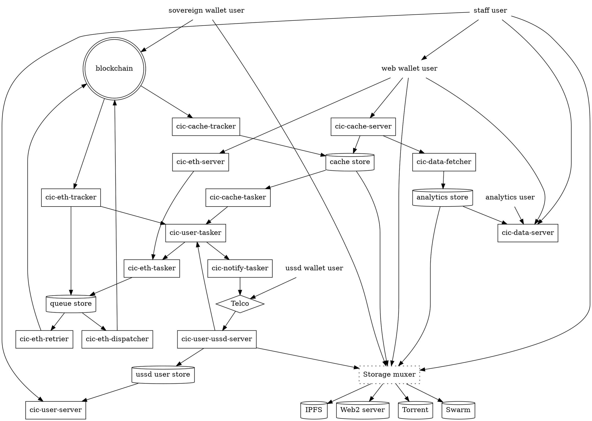

# CIC Stack Summary

While work toward non-custodial and we interfaces are underway the CIC Stack is currently a custodial wallet and blockchain bidirectional interface engine for community inclusion currencies

- Fully Open source GPL 3.0 License
- Automates the full lifecycle of blockchain transactions
- Chain agnostic by design
- Introduces a new chain library toolset written from scratch
- Modular design with fully standalone but recombinable components
- Includes a broad collection CLI tools for most common chain and engine operations
- Empowers implementers to choose their level of abstraction
- Supports both local, containerized and decentralized environments
- Support last mile front-end apis and integrations

## System parts

- **Base components**, containing all necessary provisions for services and tooling. ([Chaintools](https://gitlab.com/chaintool))
- **Generic services components**, libraries, daemons and services making up the custodial engine. ([cicnet](https://gitlab.com/chaintool))
- **Deployment components**, which facilitates deployment of the custodial engine, as well as seeding data for development, demonstration and migration. ([GrassrootsEconomics](https://gitlab.com/grassrootseconomics/)) 

## Base components

- **Queue handling** ([chainqueue](https://gitlab.com/chaintool/chainqueue)): Makes sure that a transaction sent on behalf of a user is sent, resubmitted if stalled, and whose execution is verified by quering the network state. 
- **Chain syncing**, ([chainsyncer](https://gitlab.com/chaintool/chainsyncer)): Retrieves all state changes from the network and executes an arbitary number of code fragments per transaction. 
- **RPC (Remote Procedure Call) interface**, which divides in two parts:
	1. **Generic interface** ([chainlib](https://gitlab.com/chaintool/chainlib)): Concepts common to all chain-like RPCs, and provides a thread-safe interaction framework.
	1. **Ethereum interface** ([chainlib-eth](https://gitlab.com/chaintool/chainlib-eth)): An extension of the former for the Ethereum/EVM network.
- **Chain tooling** ([chainlib](https://gitlab.com/chaintool/chainlib), [chainlib-eth](https://gitlab.com/chaintool/chainlib-eth)): Granular access to all conceptual layers of chain interaction, including binary serializations and application interfaces, along with CLI (Command Line Interface) tooling framework.
- **Signer**, ([crypto-dev-signer](https://gitlab.com/chaintool/crypto-dev-signer)) Low-security keystore and signer which is easily usable in both production (provided that no external access is possible) and in any development environment.
- **Configuration** ([confini](https://gitlab.com/nolash/python-confini)): Incrementally merging configuration definition from multiple modules, and easily overriding them with command line flags and environment variables.

### Generic services components

- All smart contract wrappers in the [cicnet](https://gitlab.com/cicnet) repository.
- **CIC Contract registry** ([cic-eth-registry](https://gitlab.com/grassrootseconomics/cic-eth-registry)): Defines token and resource pointer lookup and authentication resources.
- Daemons and microservices in the **apps** subdirectories in the [cic-internal-integration](https://gitlab.com/grassrootseconomics/cic-internal-integration) monorepo, specifically:
	* **cic-eth**: Massively parallell and fault-tolerant implementation of the custodial signer/queuer/syncer engine, accepting tasks from end-users via middleware.
	* **cic-cache**: Cache syncer and database fetching and storing details on transactions of interest.
	* **cic-ussd**: State machine, microservices and gateway for end-users using the USSD (Unstructured Supplementary Service Data) interface via telcos.
	* **cic-notify**: Pluggable notification engine, initially used only for SMS notifications to end-users.
	

### Deployment components

- Data seeding and/or migrations for new development deployments. Located in the **apps/data-seeding** subdirectory of [cic-internal-integration](https://gitlab.com/grassrootseconomics/cic-internal-integration).
- Deployment and initialization of network resources (smart contracts etc) and initialization of the custodial engine. Located in the **apps/contract-migrations** subdirectory of [cic-internal-integration](https://gitlab.com/grassrootseconomics/cic-internal-integration).

## Design principles

The guiding principles for this new system are described as subsections below.

### Massively scalable

The queueing and syncing engine should be able to queue and sync state change requests and state queries to the full capacity of the integrated networks, without any loss of data and with minimum middleware latency for the end-user.

### Avoid lock-ins

.. whether by opacity, complexity or license terms.

No part of the system should rely on and/or integrate with libraries or services that cannot be reasonably understood and/or adapted.

Nor should the work required to replace a component be unreasonable large as a result of external dependencies.

It should also be straightforward for services implementers to choose their own services dependencies (like chains, chain nodes, SaaS deferrals etc).

### Lean dependency graph

The base components should make use of primitives and standard libraries as much as possible.

The services components written for Grassroots Economics specifically should only rely on generic base components.

### Network state as the source of truth

Changes to state is sent to network immediately.

State queries made through the engine always retrieve state from network before being adjusted.

### Split engine into reusable modules

Which in essence is practical implementation of the "system parts" chapter below.

### No soft lock-in to virtual environments

Too many modern software projects only provides reasonable ease of use through mechanisms like Docker or similar frameworks.

Care should be taken to incur minimum penalty for using the application and tooling in a local host environment.

Documentation must exist and be maintained to facilitate this.

Furthermore, there should exist local-only alternate services of the underlying base components. Example of this is the [chaind](https://gitlab.com/chaintool/chaind) / [chaind-eth](https://gitlab.com/chaintool/chaind-eth) pair which enables queue/sync dynamics in a local services (e.g. systemd) environment for an independent wallet.

### Coherent configurations regardless of entry-point

Merged ini-format configuration files constitue configuration schemas and overrides, translating to a configuration directive vocabulary overrideable by environment variables of the same name.

### CLI tooling framework

Layered definitions of command line arguments, so that concepts common for each layer is only defined in one place.

Full and intuitive control of overriding configuration directives with command line arguments and flags.

Easy generation of base resource objects (such as rpc, wallet) directly from rendered configurations.

Faciliate and encourage use of chainable commands (e.g. UNIX pipelines).
