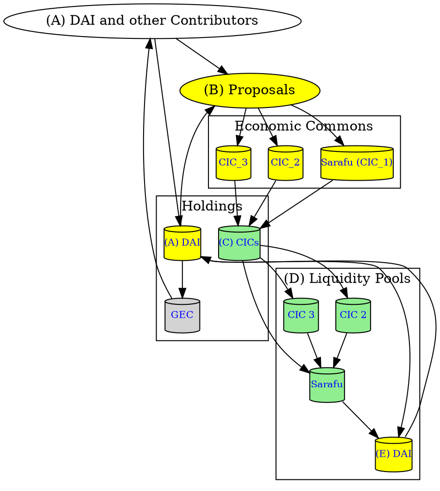

# Grassroots Economic Commons Equity (GEC Equity)

This document is a work in progress and needs your input. Please join our [chat server](https://discord.gg/Jkm4YJ8D). 

The GEC Equity is an Instrument credted by the [Grassroots Economic Commons](https://docs.grassecon.org/commons/agreement/) which implements the [Grassroots Economics Commons License v1](https://docs.grassecon.org/commons/license/). The GEC Equity inherits the vision and aims of the Grassroots Economics Commons.

The purpose of the GEC Equity is to enable supporters to covestment into Economic Commons through Curation of viable Vouchers and Cultivation of their utility and Connection to markets.

## Thanks
The creation of this instrument wouldn't have been possible without [Commons Stack](https://commonsstack.org/)'s guidance. This document represents a rough draft and synthesis of ideas presented by Commons Stack in support of Grassroots Economics Foundation.

## Draft Process
1. Hatch: This initial creation of the GEC Equity Instrument 
    1. The Grassroots Economic Commons will create a GEC Equity (ERC20 contract herein called GEC) with voting rights on all GEC Equity related issues (such as proposals on contract parameters and the usage of Reserve and Community Pools).
    2. Supporters will be invited to place DAI (USD stable coin) into the Reserve Pool and receive GEC (becoming members).
    3. GEC will be bonded to this Reserve Pool of DAI and issued to supporters and as well to people who provide in-kind support (past and future). The Bonding will be in the form of a Bonding Curve [TBD] such that the more DAI added to the Reserve Pool the less GEC are minted, and the more GEC that are burnt (redeemed for Reserve Pool DAI) the less DAI is released.
1. Curate Gardens: Economic Commons used herein are: Social enterprises, organizations, or associations that ratify the GECL v.1 and also offer important services to society and have an Instrument redeemable as payment for those services.
    1. GEC holders will be encouraged to curate proposals/opportunities to support/cultivate other Economic Commons and GEC holders will vote on proposals.
2. Cultivate: Support these curated Economic Commons in order to increase their services offerings and utility.
    1. With a successful vote, curated Economic Commons will be allocated DAI or other GEC holdings.
    2. In return for Cultivation, Instruments such as Vouchers aka Community Inclusion Currencies (CICs) that represent the services provided by these Economic Commons will be placed into a CIC Holding fund controlled by the GEC.
3. Connect: Create and support markets and provide liquidity that connect Economic Commons together.
    1. A Bridging Working Group will be be tasked with developing markets and liquidity pools that connects these CICs to DAI and eachother.
    2. Liquidity pool or CIC sales revenue will return to the GEC Reserve pool.

*Above: Sketch of the GEC Equity Hatch -> Curate -> Cultivate -> Connect*

1. (A)Initial parameters are chosen and the GEC Equity Instrument contracts are deployed. GEC are allocated for working groups and sweat equity and supporters are invited to add DAI to the Reserve Pool in return for GEC.
2. (B)Curated Economic Commons are presented as proposals by GEC holders.
3. (C)GEC holders then vote on the proposals and allocate DAI in order to increase their capacity - in return for Vouchers (CICs) that go in to the CIC Treasury. Note that Economic Commons may also receive GEC and become voting members.
4. (D)Instruments held in the Community Pool and CIC Treasury can be combined to create liquidity pools that enable people to exchange instruments. This creates an exchange market for CICs.
5. (E)Fees on exchange between CICs are charged as a percentage of volume moving through the pools and are returned to the Reserve Pool.

## Community Roles

These are the initial roles recommended by Commons Stack. To contibute to this draft as well as volunteer for community roles please visit our [discord chat server](https://discord.gg/Jkm4YJ8D). 

1. Rewards: This working group is responsible for launching and maintaining Praise, and any other rewards systems being used. They coordinate quantifiers and quantification periods, as well as custody and distribute rewards to the community. Praise may be given based on member contibutions to the Commons, to well performing Economic Commons, members that curate and submit proposals and so on.

2. Communications, Marketing and Strategy: This working group is responsible for crafting and amplifying the narrative of the Commons, publishing editorial pieces, maintaining social media and strategic marketing of the Commons mission and upcoming Hatch fundraise.

3. Stewards: This working group is responsible for coordination across all working groups and leadership in the Commons.

4. Soft Gov: This working group is responsible for researching and applying best practices for governance, social collaboration and contribution rewards while implementing Ostrom’s 8 principles for governing the commons in its foundation.
   *. 1st step: Map their culture within Ostrom’s principles. How are they doing in each principle?
   *. What decisions have they taken in the last few months? Who led them? What decisions would they like to take but maybe don’t know how? 
   *. Introduce Advice Process and Do-ocracy

5. Transparency: This working group is responsible for promoting transparency, openness and mutual monitoring. Transparency records all working groups sessions and provides audits and services to ensure transparent practices are maintained across the Commons.

6. Financial: This working group is responsible for developing strategies financial sustainable. Among their primary concerns are ensuring revenue streams into the Commons

## Technical Specifications

### **Chain Specifications (CHAIN_SPEC):**

The GEC Equity instrument as well as member accounts will be deployed on the following ledger:

#### evm:gnosis_chain:100:xdai

1. **Architecture:** EVM Ethereum Virtual Machine
2. **Fork/Version:** Gnosis Chain
3. **Chain/Network ID:** 100
4. **Common Name:** xDAI

### ** GEC Equity Contract Parameters**
1. ERC20 Contract Augmented Bonding Curve: [GitHub](https://github.com/commonsswarm/augmented-bonding-curve)
2. Initialization Parameters:
    1. _tokenManager The address of the token manager contract
    2. _formula The address of the Bonding Curve Formula computation contract
    3. _reserve The address of the Reserve Pool contract
    4. _beneficiary The address of the Common Pool contract (to whom fees are to be sent)
    5. _buyFeePct The entry tribute to be deducted from buy orders (in PCT_BASE)
    6. _sellFeePct The exit tribute to be deducted from sell orders (in PCT_BASE)
3. Roles:
    1. MAKE_BUY_ORDER_ROLE: Necessary to convert collateral tokens into bonded tokens.
    2. MAKE_SELL_ORDER_ROLE: Necessary to convert bonded tokens into collateral tokens.
    3. MANAGE_COLLATERAL_TOKEN_ROLE: Used to manage more than one collateral (many bonding curves can be managed with just one instance of the app).
    4. UPDATE_FORMULA_ROLE: Used in case we need to update the bonding curve formula.
    5. UPDATE_BENEFICIARY_ROLE: Used in case we need to update the funding pool address.
    6. UPDATE_FEES_ROLE: Used to change entry and exit fees/tributes.
    7. MINT_ROLE and BURN_ROLE: It should be able to create and destroy tokens from Token Manager.
    8. TRANSFER_ROLE: It should be able to transfer funds from the Reserve Pool.
