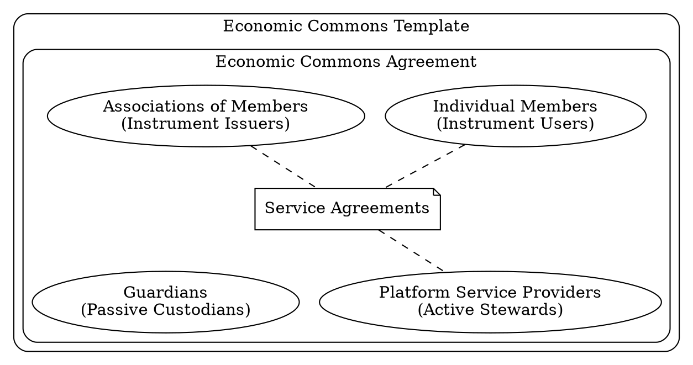

# Commons

The Commons section holds legal and governance templates for community-driven financial instruments such as Community Asset Vouchers and Commitment Pools.

Grassroots Economics uses an Economic Commons frame so communities can define rights, responsibilities, instruments, service agreements, stewardship roles, and safeguards around shared systems. The legal design draws on the [Nondominium](https://wiki.p2pfoundation.net/Nondominium) recursive framework: members define instruments together, service providers maintain active infrastructure, and guardians hold protective governance rights such as arbitration and final veto.

* [Glossary](/edu/glossary/) of terms.

Through this opt-in framework, individuals and associations can join a commons, issue or use instruments, and form member-to-member agreements while preserving shared integrity and accountability.

## Core agreements and licenses

* [Economic Commons Template (ECT)](/commons/template/): A general template for Economic Commons rights, responsibilities, roles, and instruments.
* [Grassroots Economics Commons Agreement](/commons/agreement/): The Grassroots Economics Commons Agreement using Sarafu Network as its platform.
* [Voucher Declaration](/commons/voucher/): A template for an individual or group creating a Community Asset Voucher.
* [Intermember Service Agreement](/commons/service/): A template for services between Economic Commons members and platform service providers.
* [PATH License](/commons/path/): The Public Awareness & Transparent Heritage license for Community Asset Vouchers.
* [SPROUT Policy](/commons/sprout/): The Stewarded Pools for Relational Obligations and Unified Trust license for Commitment Pools.
* [SPROUT Swap Loan Terms](/commons/sprout-loan-terms/): Terms for swap loans when a pool uses signed withdrawal terms.

## Policies

* [Data Policy](/commons/data_policy/): Grassroots Economics data protection and privacy policy.
* [Social Soil Privacy Policy](/commons/privacy_policy_social_soil/): Privacy policy for the Social Soil farming and village-trading game.
* [Child Protection Policy](/commons/child_policy/): Safeguarding policy for work involving children and young people.

For a single policy index, see [Policies](/policies/).

