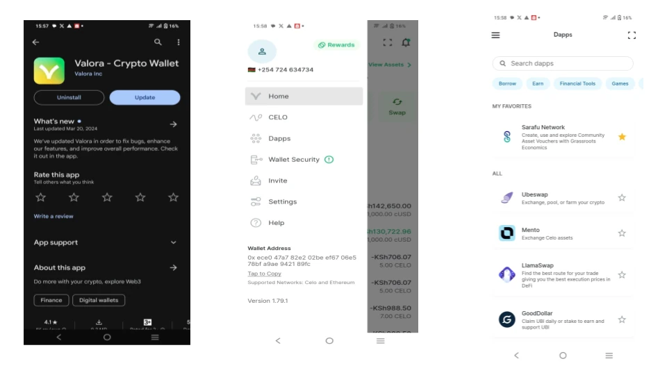
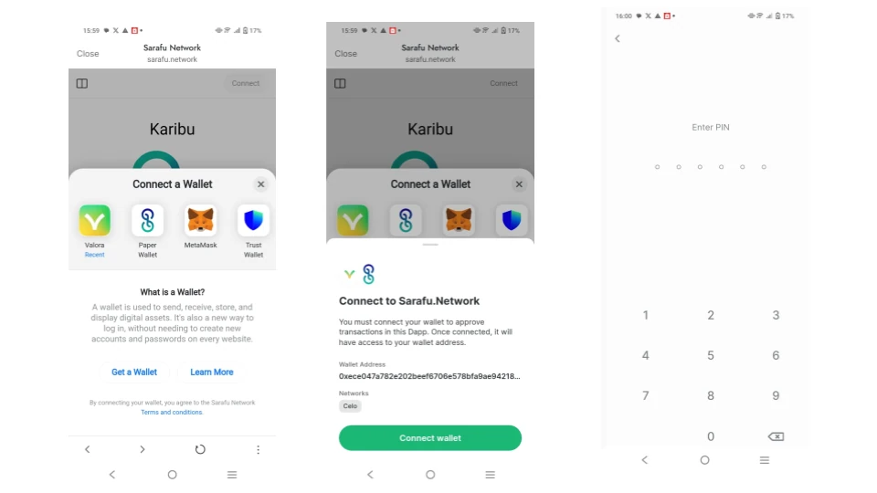
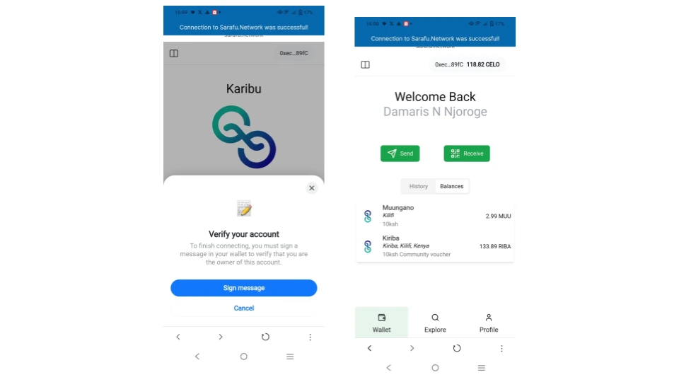
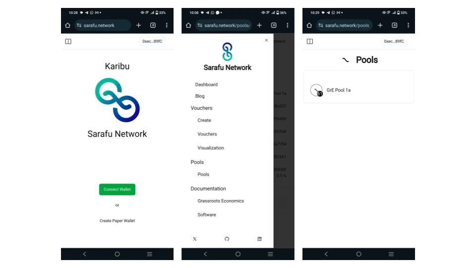
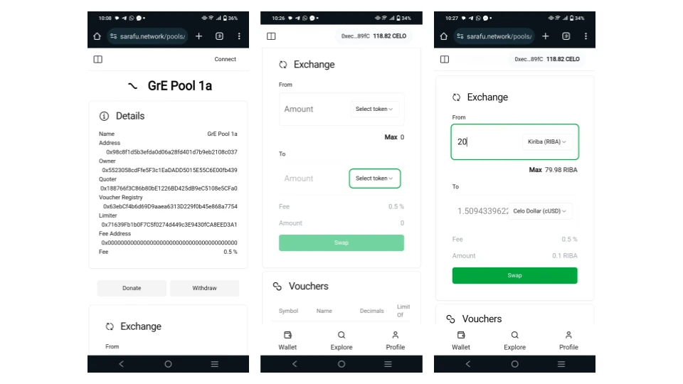
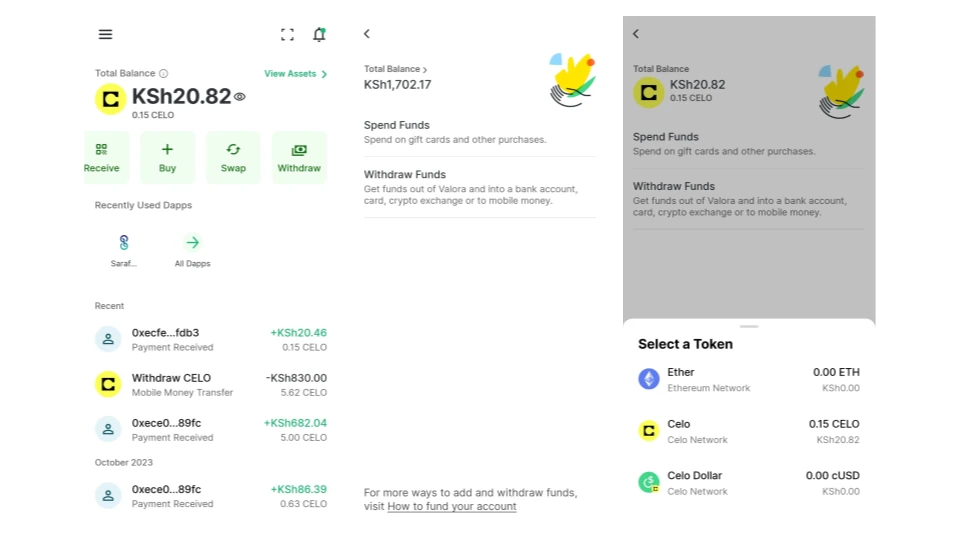

# Commitment Pool  Technical Guide - Mwongozo wa Kiufundi wa Dimbwi la Kujitolea

en: Follow this step-by-step guide to exchange Community Asset Vouchers or other digital assets for eachother within Commitment Pools .

sw: Fuata mwongozo huu wa hatua kwa hatua ili kubadilishana Vocha za Mali ya Jumuiya au mali nyingine za kidijitali kwa kila mmoja ndani ya Madila ya Kujitolea.

en: Here is a short video on using Commitment Pools with Valora.

sw: Hapa kuna video fupi kuhusu kutumia Madimbwi ya Kujitolea na Valora.

<iframe width="560" height="315" src="https://www.youtube.com/embed/wI3ch1h5rec?si=DOb7Xvfqoh38dGDK" title="YouTube video player" frameborder="0" allow="accelerometer; autoplay; clipboard-write; encrypted-media; gyroscope; picture-in-picture; web-share" referrerpolicy="strict-origin-when-cross-origin" allowfullscreen></iframe>

{: .center}

Download (Pakua) the  

en: Once you have setup your Valora wallet choose the Dapps then find Sarafu.Network

sw: Mara baada ya kusanidi pochi yako ya Valora chagua Dapps kisha utafute Sarafu.Network

{: .center}

en: Once inside Sarafu.Network clicks Connect Wallet then choose Valora - then Connect Wallet again

sw: Ukiwa ndani ya Sarafu.Network bofya Unganisha Wallet kisha uchague Valora - kisha Unganisha Wallet tena

{: .center}

en: Finally click to Sign the message and you should see your account on Sarafu.Network. 
If you have not signed up for a Social Account please do so - this gives you an alias (so you can send from ussd *384*96# to your valora account) as well as free Celo gas top ups which you will need later. Being approved for a Social Account may take up to a week.

sw: Hatimaye bofya ili kutia sahihi ujumbe na unapaswa kuona akaunti yako kwenye Sarafu.Network.
Ikiwa hujajiandikisha kwa Akaunti ya Kijamii tafadhali fanya hivyo - hii inakupa jina lak (ili uweze kutuma kutoka ussd *384*96# hadi kwenye akaunti yako ya valora) pamoja na nyongeza za bure za Celo ambazo utahitaji baadaye. Kuidhinishwa kwa Akaunti ya Kijamii kunaweza kuchukua hadi wiki.

{: .center}

en: Now click on the top left menu and find Pools. Click on the pool you want to use.

sw: Sasa bofya kwenye menyu ya juu kushoto na upate Madimbwi. Bofya kwenye bwawa unayotaka kutumia.

{: .center}

en: Scroll down to exchange and select the asset and amount that you want to swap as well as the asset you want to swap it for.
Note that you can only excahnge vouchers or other digital assets you have for what is in the pool.

sw: Tembeza chini ili kubadilishana na uchague kipengee na kiasi ambacho ungependa kubadilisha pamoja na kipengee unachotaka kukibadilisha.
Kumbuka kwamba unaweza kubadilisha vocha pekee au mali nyingine za kidijitali ulizo nazo kwa ajili ya kile kilicho kwenye bwawa.

{: .center}

en: If you swapped for cUSD you can go back to the Valora home screen and select withdraw and follow the options there to use your cUSD.

sw: Ikiwa ulibadilisha kwa cUSD unaweza kurudi kwenye skrini ya kwanza ya Valora na uchague ondoa na ufuate chaguo huko ili kutumia cUSD yako.