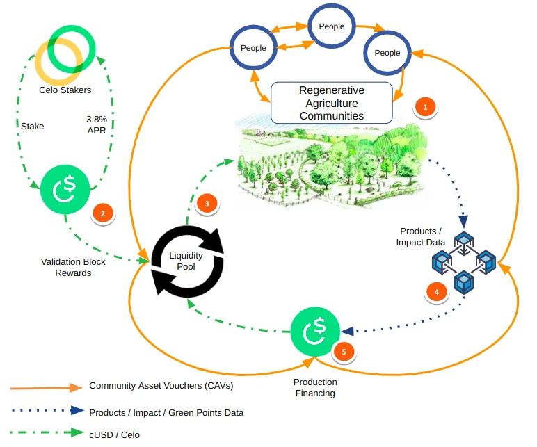

#  Staking
Grassroots Economics Foundation is thrilled to announce this initiative to drive change and foster economic empowerment. As an elected validator on the **Celo network**, we're inviting you to stake your CELO with us and join a transformative journey towards global sustainability and financial inclusion.

By staking your CELO, you'll earn a competitive ~3.8% APR (an additional yearly increased to your stake Celo of approxiemately 3.8% - for 1 Million Celo you will recieve 38,000 yearly), while contributing to our ambitious goal of cultivating 1 million acres of regenerative agriculture and over 10,000 daily peer to peer transactions in the next five years. Your support extends beyond financial growth, directly impacting communities by enabling access to the Celo ecosystem, supporting agro-forestry, and revitalizing and interconnecting indigenous mutual aid practices.

With a robust track record of community-driven projects, Grassroots Economics and Sarafu.Network is poised to significantly grow the usage and impact of the Celo blockchain. Our partnership with organizations like the Red Cross for decentralized scaling underscores our commitment to global outreach and economic empowerment.

Join us in making a difference. Stake your CELO with Grassroots Economics and be part of creating a more inclusive, sustainable world. Together, we can transform lives and nurture the planet for future generations.

{: .center}

1. Communities create a commitment toward environmental services as well as other related products (in the form of a CAVs (ERC20 Celo tokens))
2. Validation Block Rewards (cUSD) are deposited into the liquidity pool (revolving fund) (With 3.8% APR for stakers)
3. The Liquidity Pool accepts the vouchers of Grassroots Economics accredited agroforestry communities. These CAVs are exchanged for cUSD in the pool.
4. Products from the community are verified and made available for purchase using the CAV vouchers. Digital verification data will be pushed to IPFS and certified by Environmental Expert driven certifications.
5. Anyone can exchange cUSD or Celo for CAVs to support communities and can also exchange the CAVs to receive products.

# Current Stake

To check the total current stake on the GrassrootsEconomics validator (group) check the number of **Votes** [here](https://celoscan.io/address/0xd8457a4b949c1b7Bc26538F54743Aa61EEcA38B6#info).

# Staking Guide

Follow this step-by-step guide to stake with the **Grassroots Economics** validator on Celo.

## Disclaimer

This is not financial advice. Staking, delegation, and cryptocurrencies involve a high degree of risk, and there is always the possibility of loss, including the failure of all staked digital assets.

## Obtaining CELO

You can obtain CELO using any of the following options:

1. Buy on [Binance](https://www.binance.com).
2. Buy on [Coinbase](https://www.coinbase.com) (Listed as CGLD).
3. Buy on [Ramp](https://ramp.network/).
4. Buy on [Banxa](https://banxa.com/).
5. [Bridge](https://docs.celo.org/protocol/bridge#bridges-available-on-celo) from other blockchain.

You can stake using multiple approaches:

#  Staking with Othello Wallet

### 1. Setup Othello Wallet

Visit [Othello Wallet](https://celowallet.app/setup) website. You can alternatively install a Desktop version (Recommended) by  clicking on the "Download for Desktop" on the bottom of the webiste.

### 2. Choose a Login Option

#### Create a New Account

If you choose “Create New Account”, you can see your public address and mnemonic word phrase as in the screenshot. Copy your mnemonic word phrase and keep it safe. Click the continue button to go on.

Set your password with at least one capital letter. Enter your password again in “Confirm Password” blank. Just as the mnemonic word phrase, you must keep your password safe. Click the “Set Password” button to continue.

If you saw this pop-up screen, click the “I Understand” button unless you miss anything. Now, you finish making the new account! You can enter your account and check it in [Celo explorer](https://celoscan.io).

#### Use an Existing Account

There are two options to log in to the wallet using an existing account. We will use the “Use Account Key” option in this guide. If you want to login with Ledger, try this Link.

Enter your mnemonic word phrase in the blank. Then, click the “Import Account” button.

Enter your password twice and click the “Set Password” button.

You will see the pop-up screen as above. Click the “I Understand” button and you can log in to the wallet.

### 3. Lock CELO

**To stake CELO, you should lock CELO, vote for a validator group, and activate your votes in sequence.**

Click the “More” button and you will see 6 tabs including “Lock” and “Stake” buttons. Click on the “Lock” first.

Enter the amount of CELO you want to lock. Remember that you must leave some CELO to pay for the fee. You could vote for a validator group or governance proposals. Press the “Continue” button if you decide how much CELO you want to lock.

You should wait for about a minute to finish locking CELO. When it’s completed, you will see the pop-up screen that indicates your lock request was successful.

### 4. Vote for Grassroots Economics

You can check the changes to your account on the left. If there’s no problem, click the “More” button again, and press the “Stake” tab. Then, the validators list will show up.

Find **GrassrootsEconomics** and click it. Addresses and “Vote for Group” button will appear. Click the button.

Enter the amount of Celo you want to vote. Also, we remind you that you should leave some Celo to pay for the fee. Click the “Continue” button to go on.

Check your value for staking and the fee. Click the “Vote” button when everything is alright.

### 5. Activate your votes

**This step can only be completed 24 hrs after voting for GrassrootsEconomics**

When you access the Celo Wallet 24 hours later, you will see the pop-up screen that informs you to activate your votes. Click the “Activate” button.

Confirm your votes are correct. Continue if there’s anything wrong.

Check your votes once again. Press the “Activate” button to finish the staking.

Now, you’ve completed all steps for the staking. Staking rewards will be automatically paid once a day.
