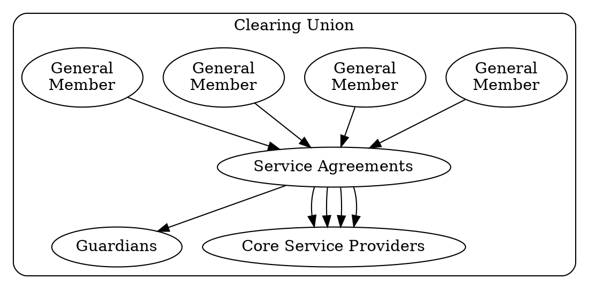

# Introduction to Legal

The following documentation is meant to give you templates on designing legal frameworks surrounding community driven financial instruments like Community Inclusion Currencies. [Here](/legal/data_policy/) you can also look at the Data Protection Policy of Grassroots Economics Foundation.

## Legal Framework

This legal design for a Economic Commons utilizes the [Nondominium](https://wiki.p2pfoundation.net/Nondominium) recursive framework, where mutually defined Instruments are utilized by (General Members) who jointly oversee active stewards (Service Providers) subject to passive custodians (Guardians) with protective governance rights of arbitration and final veto.

By developing an inclusive legal Nondominium framework an open community is created that anyone can opt into and as long as the protocols are followed they can develop member to member agreements which decentralize the commons and maintaining integrity.

- The Economic Commons can be broken into various agreements:
    *  [Grassroots Economics Commons License 1 (GECL 1)](/legal/gecl1/): A general overarching template that defines an economic commons which can be implemented.
    *  [Sarafu Clearing Union](/legal/scu/): An the Sarafu Clearing Union incorporates the GECL 1 as a Platform Service Provider which offers training, clearing, mediation, and running various micro-services, like blockchain nodes, wallets and marketplaces.
    *  [Voucher Creation](/legal/cu_group/): An example of an individual or group that wants to create a Voucher withing the SCU
    *  [Intermember Service Agreement](/legal/cu_intermember/): Establishes agreements between SCU Members

Note that performing legal due diligence is extremely important in any country you are in. 

