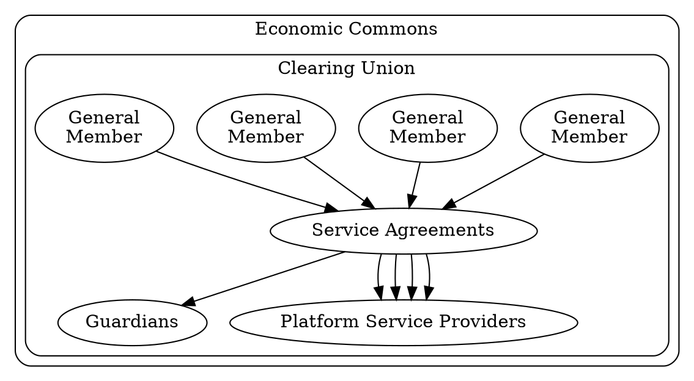

# Introduction to Legal

The following documentation is meant to give you templates on designing legal frameworks surrounding community driven financial instruments like Community Inclusion Currencies.

## Legal Framework

This legal design for a Economic Commons utilizes the [Nondominium](https://wiki.p2pfoundation.net/Nondominium) recursive framework, where mutually defined Instruments are utilized by (General Members) who jointly oversee active stewards (Service Providers) subject to passive custodians (Guardians) with protective governance rights of arbitration and final veto.

By developing an inclusive legal Nondominium framework an open community is created that anyone can opt into and as long as the protocols are followed they can develop member to member agreements which decentralize the commons and maintaining integrity.

- The Economic Commons can be broken into various agreements:
    * [Grassroots Economics Commons License v1 (GECL v1)](/legal/gecl1/): A general overarching template that defines an Economic Commons and various rights and responsibilities of its Members.
    * [Sarafu Clearing Union](/legal/scu/): The Sarafu Clearing Union (SCU) is an example Economic Commons which incorporates the GECL v1 with Grassroots Economics Foundation's Sarafu Network as its Platform. Futher Grassroots Economics as a Platform Service Provider declares the Sarafu Voucher and offers training, clearing, mediation, and running various micro-services, like blockchain nodes, wallets and marketplaces.
    * [Voucher Creation](/legal/scu_voucher/): An example of an individual or group that wants to create a Voucher within an Economic Commons
    * [Intermember Service Agreement](/legal/scu_service/): Establishes agreements between SCU Members. In this example a Voucher creating Member wishes to subscribe to the services of a Platform Service Provider.
    * [Data Policy](/legal/data_policy/): Here is an example of a data protection policy of Grassroots Economics as a Platform Service Provider.

