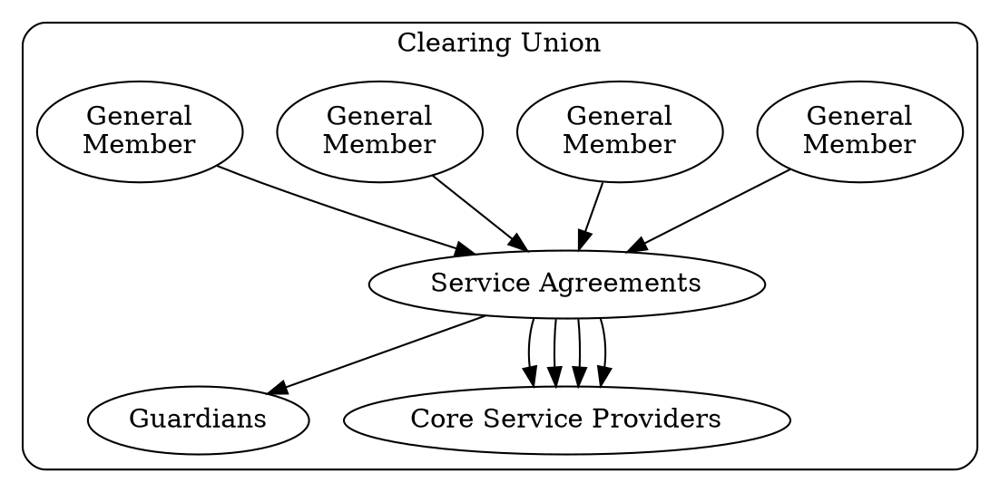

# Introduction to Operations

The following documentation is meant to give you an idea and examples of implementations in Kenya. These documents can act as general templates for how to setup a Community Inclusion Currency.

## Legal Framework

This legal design for a Fiscal Commons utilizes the 'Nondominium' framework developed by Chris Cook, where mutually defined Instruments are utilized by (General Members) who jointly oversee active stewards (Service Providers) subject to passive custodians (Guardians) with protective governance rights of arbitration and final veto.

By developing an inclusive legal frame work you create an open community that anyone can jion and as long as the agreements are followed they can develop member to member service agreements. 

- The agreements Legal Structures can be broken into various agreements:
    *  [Sarafu Clearing Union agreement](/sarafu_clearing_union/)
    *  [Member Agreement (Core Service Providers)](/scu_member_csp/)
    *  [General Member Agreement (Groups)](/scu_member_group/)
    *  [Intermember (Service) Agreement](/scu_membership/)

Note that performing legal due diligence is extreemly important in any country you are in. 

## Technology Setup

Generally the technical setup is done by a local Core Service Provider like Grassroots Economics. The more local the better.

1. **Open Source (CopyLeft) Software**: Ensure that you trust the software being used and that even if it is open source now, that improvements and upgrades will remain open source. Check out our [stack](/cic_stack/).
1. **Distributed Ledger**: We highly recommend developing your own ledger system where members of the community hold nodes that decentralize and secure the ledger.
1. **Interfaces / Wallets**: We’ve built custodial systems that enable users to assign guardians that can help them reset lost passwords. 
1. **Data Sharing**: Given the consent of the community, anonymous transaction data can be recorded and displayed 

## Voucher Creation

Our [Community Training Guide](/training/) gives a basic training for identifying local resources and sharing them together using a CIC. 

1. **Resource Mapping**: Working with your community to map out resources and needs. Often people don’t realize how much they can offer and how much they can support each-other. The Training guide goes through the majority of these steps. Also note that individuals and organizations like Grassroots Economics can create their own vouchers.
1. **Learning through games**: Demonstrate 
Collective Commitments: Coming up with agreements on what each member of the community can offer to the whole in exchange for vouchers. 
1. **Audits, Endorsements and Conflict Mitigation**: Commitments should be internally audited by the community and as well with a designated auditor to ensure that the vouchers can be redeemed in a  reasonable amount of time. A mediator should be assigned to deal with conflicts, like when a member spends but refuses to redeem vouchers they created.
1. **Clearing Union Membership Agreement**: The above work is collected into a membership agreement to a Clearing Union. 
1. **Service Agreement**: Should the community need a service provider, then an agreement is developed between the community and a Core Service Provider.
1. **Minting / Voucher Creation**: This is generally handled by  a Core Service Provider like Grassroots Economics, who will validate the groups commitments, audits and endorsements and deploy a contract on a ledger that is visible to anyone. This contract (smart contract) will hold all the relevant information about the Voucher and create the supply. 
1. **Initial Voucher Distribution**: After minting, Vouchers will then be distributed to the Community that has committed to redeeming them with full transparency. This will be done as per the instructions of the community and can be facilitated by a community treasurer. It is recommended to have a voted on community fund /treasury which will also collect any levies (demurrage). 
1. **Greater Community Outreach**: While the community of issuers may begin to assign and clear vouchers among each other, they will generally want to spread their usage to their greater community. They can choose to give new users a small amount out of a community fund as is done with Sarafu, or to simply try to sell the Vouchers or use them to buy goods or services.
1. **Long Term Maintenance**: Imbalance / inequality is a common character of any credit system. Some people may end up with a lot and some people may end up with zero. Having regular meetings, or market days and actively clearing imbalances together is highly recommended. A levy on accounts is a good way to ensure that people have no incentive to hold Vouchers as a form of savings or investment and that they continue to circulate as a medium of exchange.

## Humanitarian Support

1. **Stakeholder Gatherings and Trainings**: These are similar to the steps mentioned in Voucher creation, but will often involve a wider range of stakeholders including local government. 
1. **Capacity Building**: When identifying resources that people have to share – gaps in those resources compared to need often arise. Filling these gaps through training and asset development can help the community have a solid framework for voucher redemption. 
1. **Evidence based support**: Based on results from Impact Data resulting from Voucher circulation a Humanitarian organization can choose to purchase vouchers from the Community Group and redistribute those to people in need.

