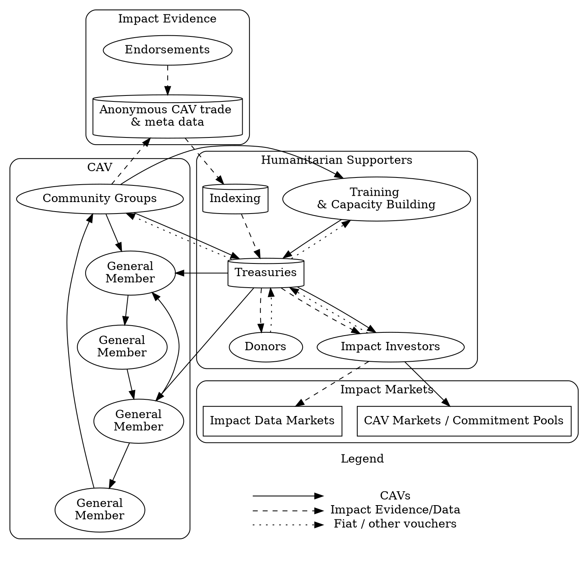

# Humanitarian Support

Supporters that wish to help empower communities and build strong resilient and regenerative local economies toward other goals like sustainable envirmental or educational programs, have a lot of options when working with Community Asset Vouchers CAVs.

1. **Stakeholder Gatherings and Training**: These are similar to the steps mentioned in [Voucher creation](/ops/voucher/), but will often involve a wider range of stakeholders including local government.
1. **Capacity Building**: When identifying resources that people have to share – gaps in those resources compared to local needs often arise. Filling these gaps through [training](/operations/training/) and communal asset development can help the community have a solid framework for sustainable voucher redemption.
1. **Evidence based support**
    1. **Impact Indexing**: Data from CAV circulation and endorsements from validators is indexed based on Sustainable Development Goals and a rank and reward can be calculated for support
    1. **Donor Support**: Donors can recieve impact data in the form of a digital certificate they can also followup on future impacts.
    1. **Treasuries**: Based on results from Indexing a Humanitarian organization can choose to purchase vouchers with donor funds (held in *Treasuries*).
    1. **Redistribution**: Based on results from Indexing CAVs held in *Treasuries* can be redistributed directly to those people in need.

