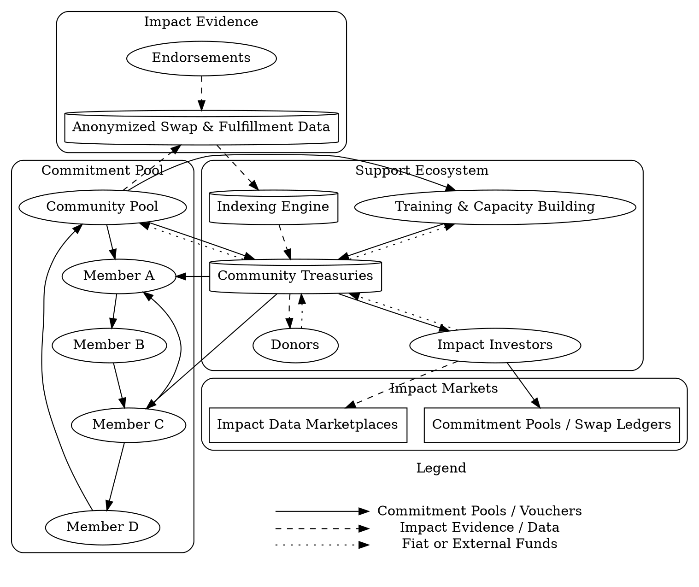

# Humanitarian Support

Supporters seeking to empower communities and cultivate resilient, regenerative economies—whether for environmental goals, education, health, or mutual aid—have a variety of ways to engage through **Commitment Pooling**.

Commitment Pooling shifts support from charity to reciprocity—honoring local contributions and routing support through trusted commitments.

## Ways to Support

1. **Stakeholder Gatherings and Training**  
   Similar to the process described in [Voucher Creation](/ops/voucher/), initial gatherings should include local leaders, community groups, and government. These sessions introduce the Commitment Pooling model and help coordinate trust flows.

2. **Capacity Building**  
   Through resource mapping and exchange simulations, gaps between community needs and existing capacities are identified. Supporters can fill these gaps through training, toolkits, and shared assets that enhance the community’s ability to fulfill its pooled commitments.

3. **Evidence-Based Support**  
   Commitment Pooling produces traceable, anonymized data on trust, exchange, and fulfillment.

   - **Impact Indexing**  
     All voucher circulation, redemptions, and endorsements are indexed to SDGs and local goals.
   
   - **Donor Support**  
     Donors receive digital certificates of impact and may follow future flows of support.
   
   - **Treasuries**  
     Donor contributions can be converted into pool-compatible vouchers and held in community treasuries.
   
   - **Redistribution**  
     Vouchers in treasuries may be routed to vulnerable members or used to fund local commons efforts (like clean water or education initiatives).

