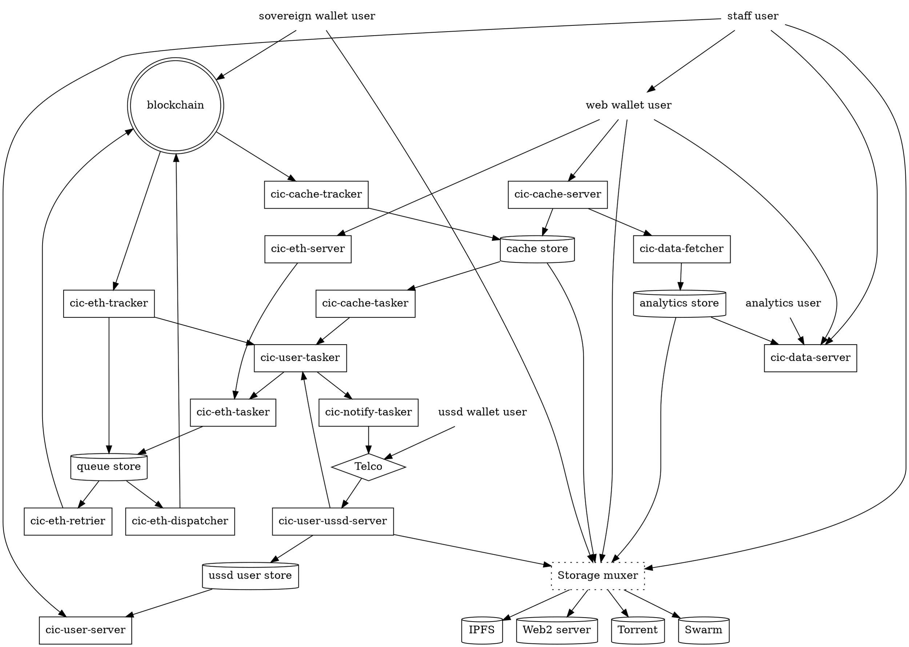

# CIC Software

## Technology Setup

Generally the technical setup is done by a local Platform Service Provider like Grassroots Economics. The more local the better.

1. **Open Source (CopyLeft) Software**: Ensure that you trust the software being used and that even if it is open source now, that improvements and upgrades will remain open source. Check out our [stack](/software/).
1. **Distributed Ledger**: We highly recommend developing your own ledger system where members of the community hold nodes that decentralize and secure the ledger.
1. **Interfaces / Wallets**: We’ve built custodial systems that enable users to assign guardians that can help them reset lost passwords.
1. **Data Sharing**: Given the consent of the community, anonymous transaction data can be recorded and displayed

## CIC Stack Summary

While work toward *non-custodial* and web interfaces are underway, the CIC Stack is currently a *custodial* wallet and blockchain bidirectional interface engine for community inclusion currencies

- Fully Open source GPL 3.0 License
- Automates the full lifecycle of blockchain transactions
- Chain agnostic by design
- Introduces a new chain library toolset written from scratch
- Modular design with fully standalone but recombinable components
- Includes a broad collection CLI tools for most common chain and engine operations
- Empowers implementers to choose their level of abstraction
- Supports both local, containerized and decentralized environments
- Support last mile front-end apis and integrations

## System parts

- **Base components**, containing all necessary provisions for services and tooling. ([Chaintools](https://git.grassecon.net/chaintool))
- **Generic services components**, libraries, daemons and services making up the custodial engine. ([cicnet](https://git.grassecon.net/chaintool))
- **Deployment components**, which facilitates deployment of the custodial engine, as well as seeding data for development, demonstration and migration. ([GrassrootsEconomics](https://git.grassecon.net/grassrootseconomics)) 
- [Test Coverage](https://coverage-reports.grassecon.net/)

## Base components

- **Queue handling** ([chainqueue](https://git.grassecon.net/chaintool/chainqueue)): Makes sure that a transaction sent on behalf of a user is sent, resubmitted if stalled, and whose execution is verified by quering the network state. 
- **Chain syncing**, ([chainsyncer](https://git.grassecon.net/chaintool/chainsyncer)): Retrieves all state changes from the network and executes an arbitary number of code fragments per transaction. 
- **RPC (Remote Procedure Call) interface**, which divides in two parts:
	1. **Generic interface** ([chainlib](https://git.grassecon.net/chaintool/chainlib)): Concepts common to all chain-like RPCs, and provides a thread-safe interaction framework.
	1. **Ethereum interface** ([chainlib-eth](https://git.grassecon.net/chaintool/chainlib-eth)): An extension of the former for the Ethereum/EVM network.
- **Chain tooling** ([chainlib](https://git.grassecon.net/chaintool/chainlib), [chainlib-eth](https://gitlab.com/chaintool/chainlib-eth)): Granular access to all conceptual layers of chain interaction, including binary serializations and application interfaces, along with CLI (Command Line Interface) tooling framework.
- **Signer**, ([crypto-dev-signer](https://git.grassecon.net/chaintool/crypto-dev-signer)) Low-security keystore and signer which is easily usable in both production (provided that no external access is possible) and in any development environment.
- **Configuration** ([confini](https://gitlab.com/nolash/python-confini)): Incrementally merging configuration definition from multiple modules, and easily overriding them with command line flags and environment variables.

### Generic services components

- All smart contract wrappers in the [cicnet](https://git.grassecon.net/cicnet) repository.
- **CIC Contract registry** ([cic-eth-registry](https://gitlab.com/grassrootseconomics/cic-eth-registry)): Defines token and resource pointer lookup and authentication resources.
- Daemons and microservices in the **apps** subdirectories in the [cic-internal-integration](https://gitlab.com/grassrootseconomics/cic-internal-integration) monorepo, specifically:
	* **cic-eth**: Massively parallel and fault-tolerant implementation of the custodial signer/queuer/syncer engine, accepting tasks from end-users via middleware.
	* **cic-cache**: Cache syncer and database fetching and storing details on transactions of interest.
	* **cic-ussd**: State machine, microservices and gateway for end-users using the USSD (Unstructured Supplementary Service Data) interface via telcos.
	* **cic-notify**: Pluggable notification engine, initially used only for SMS notifications to end-users.

### Deployment components

- Data seeding and/or migrations for new development deployments. Located in the **apps/data-seeding** subdirectory of [cic-internal-integration](https://gitlab.com/grassrootseconomics/cic-internal-integration).
- Deployment and initialization of network resources (smart contracts etc) and initialization of the custodial engine. Located in the **apps/contract-migrations** subdirectory of [cic-internal-integration](https://gitlab.com/grassrootseconomics/cic-internal-integration).

## Components by category

(in no particular order)

| area | category | components | maintainer | support | tech | relative complexity | maturity |
|---|---|---|---|---|---|---|---|
| chain queue/sync base | any | [chainqueue](https://git.grassecon.net/chaintool/chainqueue), [chainsyncer](https://git.grassecon.net/chaintool/chainsyncer) | Louis | ? | py | mid | hi | 
| chain queue/sync engine | custodial | [cic-eth](https://gitlab.com/grassrootseconomics/cic-internal-integration/-/tree/master/apps/cic-eth), [cic-eth-registry](https://gitlab.com/grassrootseconomics/cic-eth-registry), [cic-signer](https://gitlab.com/grassrootseconomics/cic-internal-integration/-/tree/master/apps/cic-signer) | Louis | Phil | py, celery | hi | hi |
| notifications | custodial | [cic-notify](https://gitlab.com/grassrootseconomics/cic-internal-integration/-/tree/master/apps/cic-notify) | Phil | ? | py, celery | lo | mid |
| ussd wallet | custodial | [cic-ussd](https://gitlab.com/grassrootseconomics/cic-internal-integration/-/tree/master/apps/cic-ussd) | Phil | ? | py, celery | hi | hi |
| wallet interface translations | any | [cic-translations](https://gitlab.com/grassrootseconomics/cic-internal-integration/-/tree/master/apps/cic-eth) | Will? | Phil | yaml? | lo | hi |
| HTTP authentications | custodial | [usumbufu](https://git.defalsify.org/python-usumbufu/), [cic-auth-helper](https://gitlab.com/grassrootseconomics/cic-auth-helper) |  Louis | Blair, Sohail | py | hi | hi |
| python chain libaries | any | [chainlib-eth](https://git.grassecon.net/chaintool/chainlib-eth), [chainlib](https://git.grassecon.net/chaintool/chainlib-eth),  | Louis | (community?) | py | mid | hi |
| python signer libraries | any | [funga](https://git.grassecon.net/chaintool/funga), [funga-eth](https://gitlab.com/grassrootseconomics/cic-eth-registry) | Louis | ? | py | mid | hi |
| local queue and sync | non-custodial |  [chaind](https://git.grassecon.net/chaintool/chaind), [chaind-eth](https://git.grassecon.net/chaintool/chaind-eth), [cic-batch](https://git.grassecon.net/grassrootseconomics/cic-batch) | Louis | ? | py | mid | ? |
| contract interfaces | any | [cic-contracts](https://git.grassecon.net/cicnet/cic-contracts), [eth-erc20](https://gitlab.com/cicnet/eth-erc20), [eth-owned](https://gitlab.com/cicnet/eth-owned), [erc20-faucet](https://gitlab.com/cicnet/erc20-faucet), [eth-interface](https://gitlab.com/cicnet/eth-interface) | Louis | ? | solidity, py, bash | mid | hi |
| ge token contract | any | [erc20-demurrage-token](https://gitlab.com/cicnet/erc20-demurrage-token), [sarafu-faucet](https://gitlab.com/grassrootseconomics/sarafu-faucet) | Louis | ? | solidity, py | hi | hi/lo |
| verificable claims base | any | [okota](https://git.grassecon.net/cicnet/okota) | Louis | ? | solidity, py | mid | hi |
| cic analytics and aggregator | custodial | [cic-data-golang](https://gitlab.com/grassrootseconomics/cic-data-golang) | Blair | Darren | golang | mid | mid |
| cic analytics views | custodial | [cic-data-golang](https://gitlab.com/grassrootseconomics/cic-data-golang) | Darren | ? | grafana, golang? | mid | ? |
| web2 metadata store | custodial | [cic-meta](https://gitlab.com/grassrootseconomics/cic-internal-integration/-/tree/master/apps/cic-meta) | ? | Louis | typescript | mid | hi |
| metadata protocol | any | [crdt-meta](https://gitlab.com/cicnet/crdt-meta) | ~~Spence~~ | ~~Geoff~~, Louis | typescript | mid | hi |
| metadata schemas | any | [cic-types](https://gitlab.com/grassrootseconomics/cic-types) | Phil | ~~Geoff~~ | py | mid | hi |
| contributor badge nft | non-custodial | [(rose bootcamp project)](https://rapid-silence-3500.on.fleek.co/), [nft-badgetoken](https://git.defalsify.org/evm-badgetoken/) | solidity, py, typescript, react(?) | Rose | Louis | mid | lo |
| web3 transition adapters | any | [fadafada](https://git.defalsify.org/fadafada/), [fadafada-curl](https://git.defalsify.org/fadafada-curl/) | Louis | (community?) | rust | mid | mid |
| cli cic creation | any | [cic-cli](https://git.grassecon.net/cicnet/cic-cli) | Phil | Louis | py | hi | mid |
| cli metadata viewer | custodial | [clicada](), [cic-staff-installer](https://git.grassecon.net/grassrootseconomics/cic-staff-client) | ? | Louis | py | lo | lo |
| ge blog | website | [pelican website](https://git.grassecon.net/grassrootseconomics/pelican-website-ge) | Ida | Will | py, pelican | lo | hi |
| ge docs | website | [docs webstie](https://gitlab.com/grassrootseconomics/grassrootseconomics.gitlab.io) | Will | ? | py, (platform)? | mid? | mid |
| local dev bootstrap | devops | [cic-stack](https://gitlab.com/grassrootseconomics/cic-internal-integration) | ? | all | bash, docker-compose | hi | hi |
| dev data seeding / migration | any | [cic-stack](https://gitlab.com/grassrootseconomics/cic-internal-integration) | Phil | Louis | py, bash, typecsript | hi | hi |
| Telegram wallet | custodial | ? | Sohail? | ? | ? | ? | no |
| chain queue/sync interface | custodial | [cic-eth-server](https://gitlab.com/grassrootseconomics/cic-internal-integration/-/merge_requests/312), ... | Lum | ? | py | ? | ? |
| Web2 wallet | custodial | [social recovery protocol](https://gitlab.com/grassrootseconomics/cic-docs/-/blob/lash/social-recovery/spec/025_social_recovery.md) | Lum | ? | ? | ? | no |
| P2P Services discovery | any | [cic-p2p](https://gitlab.com/grassrootseconomics/cic-p2p), [village message protocol](https://gitlab.com/cicnet/vmp) | Louis | ? | ? | ? | ? |
| Gas helpers | any | [cic-gas-proxy](https://gitlab.com/grassrootseconomics/eth-gas-proxy/-/blob/master/gas_proxy/proxy.py), [ethd-gas-sum](https://git.grassecon.net/chaintool/ethd-gas-sum) | Louis | ? | py | lo | lo |
| Swarm provisions | non-custodial | [libswarm-ng](https://git.defalsify.org/libswarm-ng/), [pylibswarm](https://git.defalsify.org/pylibswarm/) | Louis | (community?) | c, py | mid | hi |
| Multisig | non-custodial | [erc20-transfer-authorization](https://gitlab.com/cicnet/erc20-transfer-authorization) | Louis | ? | solidity, py | mid | lo |
| 

("Relative complexity" means complexity in relation to the function of the component.)

## Deployment requirements

There are the requirements to run our complete software stack:

### Blockchain infrastructure

- 3 x (2 CPU, 4GB RAM, 50+ GB Storage) for validator nodes future proofed for 1 yr.
- n x (1 CPU, 2GB RAM) for prunning state nodes, useful for non-custodial web3 users.

### Custodial infrastructure

- Kubernetes preffered
- 4 CPU, 8GB RAM, 50+ GB Storage minimum (Includes additional monitoring components)

